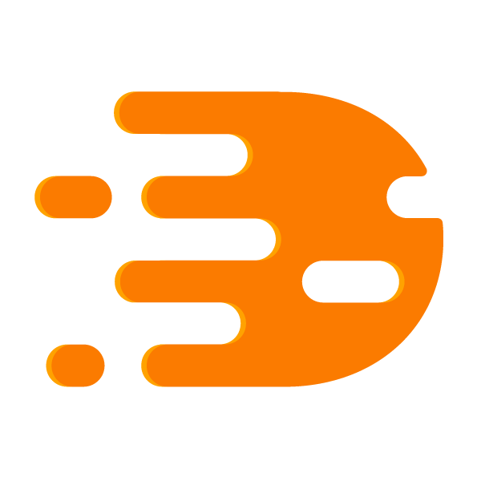

<h1>Direkt</h1>
<p align="center">
	
</p>
<p align="center">
	<a href="https://cocoapods.org/pods/Direkt">
		
	</a>
	<a href="https://github.com/Carthage/Carthage">
		
	</a>
</p>

**Direkt** is a Swift port of [DRYNavigationManager](https://github.com/appfoundry/DRYNavigationManager).

Like the original, it is meant for projects which do not rely on Storyboard segues, providing separation of navigation and view controller logic code.
It follows same architectural concept, but leverages Swift programming techniques to provide more type safety and native API feel.

## Usage

Library defines a few core protocols that the users will be working with:

- `Navigator` - Core objects responsible for navigation flow. Their task is to run the transition code e.g. pushing a view controller onto the navigation stack.
- `NavigationManager` - The task of those objects, as the name suggests, is to manage navigators. Meaning the object will need to create given navigator instance upon navigation request. `BaseNavigationManager` is an open implementaion of the protocol that you can use directly or extend.
- `Resolver` protocol type used for dependencies resolution.

Example implementation of `Navigator` pushing a view controller onto the navigation stack:

```swift
func navigate(using input: String, from hostViewController: UIViewController, resolver: Resolver) throws {
    guard let navigationController = hostViewController.navigationController else {
        throw Error.missingNavigationController
    }

    try navigationController.pushViewController(
        resolver.resolve(HelloViewController.self, input: input),
        animated: true
    )
}
```

### Example
In the repository you can find example project. 

1. Clone the repository - `git clone https://github.com/appfoundry/direkt.git`
2. Run `carthage build --platform iOS` from the `Example` directory
3. Explore the example project

## Installation

### CocoaPods

Add the line `pod "Direkt"` to your `Podfile`

### Carthage

Add the line `github "appfoundry/direkt"` to your `Cartfile` and update your Carthage `copy-frameworks` script accordingly.

## Authors

|Author           |E-mail                          |
|-----------------|--------------------------------|
|Joris Dubois     | joris.dubois@appfoundry.be     |
|Jonathan Esposito| jonathan.esposito@appfoundry.be|
|Jens Goeman      | jens.goeman@appfoundry.be      |
|Damian Malarczyk | damian.malarczyk@appfoundry.be |

## License
**Direkt** is available under the MIT license. See the LICENSE file for more info.
